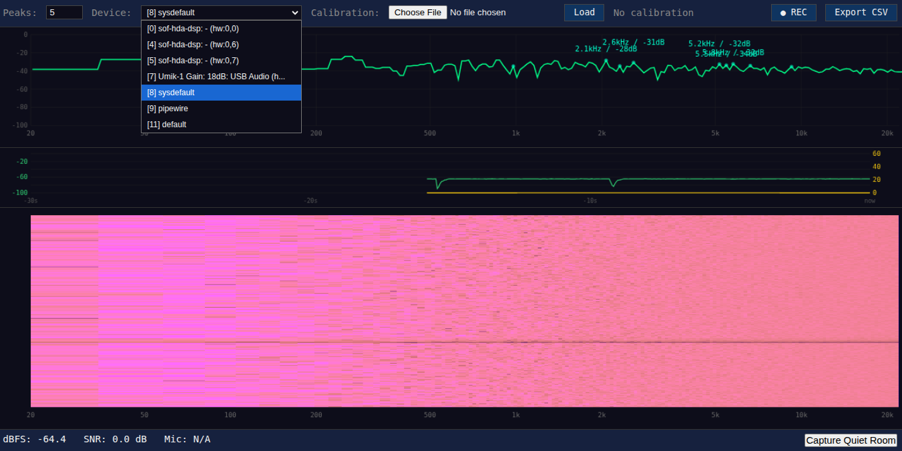

# 🎤 Audio Measurement Framework and CLI

**A Python framework and CLI toolkit for real-time audio measurement with USB microphones.**

- 📦 Use as a **library** to build custom real-time audio measurement applications
- 🕹️ Use the **bundled CLI** (`audio-tools`) for out-of-the-box measurement, recording and real-time spectrum analyzer (RTA)

Works with USB measurement microphones out of the box — auto-detects known devices, validates sample rate support, and applies per-unit calibration files.

> **PyPI package:** [`umik-base-app`](https://pypi.org/project/umik-base-app/) *(name reflects the project's origins; a rename is planned as the framework scope expands)*

```bash
pip install umik-base-app
```

## 🎛️ Verified Hardware

The framework works with any USB audio input device. The following microphones have built-in device profiles and calibration support:

| Microphone | Manufacturer | Sample Rates | Sensitivity |
|------------|--------------|--------------|-------------|
| UMIK-1 | miniDSP | 48 kHz | −18 dBFS |
| UMIK-2 | miniDSP | 44.1–192 kHz | −18 dBFS |
| UMM-6 | Dayton Audio | 48 kHz | −18 dBFS |
| XREF 20 | Sonarworks | 48 kHz | −26 dBFS |
| MM 1 | Beyerdynamic | 44.1–192 kHz | −40 dBFS |
| M23/M30 | Earthworks | 44.1–192 kHz | −36 dBFS |

Custom device profiles can be added — see [docs/FRAMEWORK.md](./docs/FRAMEWORK.md).

## ⚡ Quick Start — Library

Subclass `AudioSink`, wire it into an `AudioPipeline`, and let `AudioBaseApp` handle device management, threading, reconnection, and calibration injection:

```python
from umik_base_app import AppArgs, AudioBaseApp, AudioPipeline, AudioSink, PipelineContext

class LoudnessPrinter(AudioSink):
    def handle(self, ctx: PipelineContext) -> None:
        if ctx.can_calculate_dbspl():
            print(f"[{ctx.timestamp}] dBSPL: {ctx.reference_dbspl:.1f}")

def main():
    args = AppArgs.get_args()
    config = AppArgs.validate_args(args)

    pipeline = AudioPipeline(sample_rate=config.sample_rate)
    pipeline.add_sink(LoudnessPrinter())

    # If --calibration-file was passed, CalibratorAdapter is auto-injected
    app = AudioBaseApp(app_config=config, pipeline=pipeline)
    app.run()

if __name__ == "__main__":
    main()
```

Run it with any standard flags:

```bash
python my_app.py --calibration-file "umik-1/7175488.txt"
python my_app.py --producer --zmq-port 5555   # daemon / distributed mode
```

## 🏗️ Framework Concepts

| Class | Role |
|-------|------|
| `AudioSink` | Protocol — implement `handle(ctx)` to consume audio (metrics, recording, UI) |
| `AudioTransformer` | Protocol — implement `apply(ctx)` to modify audio (filtering, gain) |
| `PipelineContext` | Per-chunk envelope: audio samples, timestamp, calibration metadata |
| `AudioPipeline` | Ordered transformer chain + fan-out sink execution |
| `AudioBaseApp` | Lifecycle manager: device init, threads, transport, reconnection |
| `AudioMetrics` | Static helpers: `dBFS`, `dBSPL`, `RMS`, `LUFS`, `spectral_flux` |

Full API reference and examples: [docs/FRAMEWORK.md](./docs/FRAMEWORK.md)

## 🕹️ Bundled Sample Apps (CLI)

The package ships a set of reference applications accessible via `audio-tools`. These demonstrate the framework and are ready to use out of the box:

| Command | Description |
|---------|-------------|
| `audio-tools --devices` | 🔍 List available audio input devices |
| `audio-tools --meter` | 📊 Real-time SPL / LUFS / dBFS meter |
| `audio-tools --record` | 🎙️ Calibrated audio recorder (WAV) |
| `audio-tools --calibrate` | 🔧 Generate FIR filter from a calibration file |
| `audio-tools --analyze` | 🔬 Analyze a WAV file and export metrics to CSV |
| `audio-tools --plot` | 📈 Plot a metrics CSV as a chart |
| `audio-tools --batch` | 📁 Batch-analyze a directory of WAV files |
| `audio-tools --enhance` | ✨ Filter and enhance voice audio |
| `audio-tools --convert` | 🔄 Convert WAV recordings to OGG / MP3 / AAC |
| `audio-tools --clip` | ✂️ Trim a WAV file to a time range |
| `audio-tools-spectrum` | 🌐 Browser-based real-time spectrum analyzer (RTA) |
| `audio-tools-clip` | 🎛️ Browser-based waveform clip editor |

### 🌐 Spectrum Analyzer



A browser-based **Real-Time Analyzer (RTA)** — comparable to the RTA panel in REW — with FFT plot, scrolling waterfall, time-series dBSPL/dBFS, noise floor baseline, and in-browser calibration loading. Opens automatically at `http://localhost:8767`.

```bash
audio-tools-spectrum --device <id> --calibration-file "umik-1/7175488.txt"
```

Full CLI reference: [docs/CLI.md](./docs/CLI.md)

## 📦 Installation

### pip *(recommended)*

```bash
pip install umik-base-app
```

Requires system libraries:

```bash
# Linux (Debian/Ubuntu)
sudo apt install libportaudio2 libsndfile1 ffmpeg libzmq3-dev -y

# macOS
brew install portaudio libsndfile zeromq ffmpeg
```

### APT — Linux headless deployment

For Raspberry Pi and Ubuntu servers, a `.deb` package installs system dependencies automatically:

```bash
curl -fsSL "https://br-se1.magaluobjects.com/audio-tools/audio-tools/pubkey.gpg" \
  | sudo gpg --dearmor -o /usr/share/keyrings/audio-tools.gpg
echo "deb [signed-by=/usr/share/keyrings/audio-tools.gpg] https://br-se1.magaluobjects.com/audio-tools/audio-tools $(lsb_release -cs) main" \
  | sudo tee /etc/apt/sources.list.d/audio-tools.list
sudo apt-get update && sudo apt-get install audio-tools
```

> 🍓 Raspberry Pi 4B verified. Suitable for headless acoustic monitoring boxes.

## 🔗 Related Projects

[**py-edge-ai-acoustic-monitoring-app**](https://github.com/danielfcollier/py-edge-ai-acoustic-monitoring-app) — adds ML sound classification (chainsaws, glass breaking, birds) on embedded devices, built on top of this framework.

## 📚 Documentation

| Doc | Description |
|-----|-------------|
| [docs/FRAMEWORK.md](./docs/FRAMEWORK.md) | Library API, custom sinks/transformers, device profiles |
| [docs/CLI.md](./docs/CLI.md) | Full CLI reference, run modes, calibration, TUI, spectrum analyzer |
| [docs/ARCHITECTURE.md](./docs/ARCHITECTURE.md) | Producer-Consumer design, transport layer, pipeline internals |
| [docs/METRICS.md](./docs/METRICS.md) | RMS, LUFS, dBFS, dBSPL formulas explained |
| [docs/UMIK-Series.md](./docs/UMIK-Series.md) | Hardware-specific calibration details |
| [CONTRIBUTING.md](./CONTRIBUTING.md) | Dev setup, testing, CI workflow |
