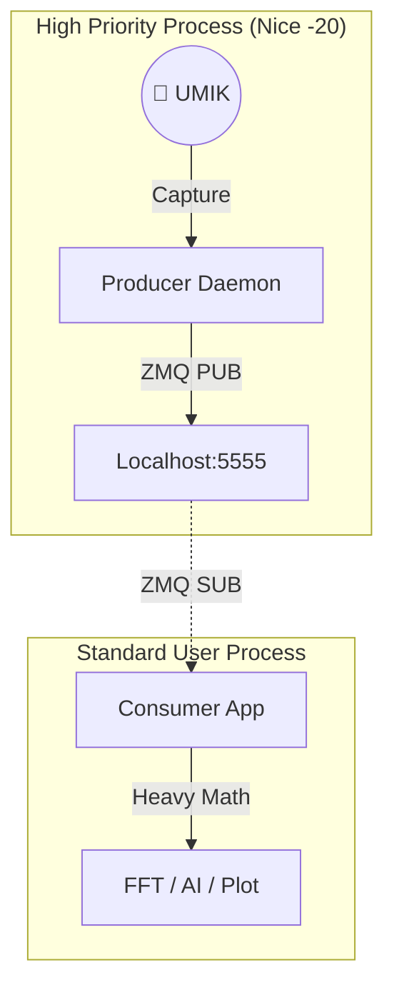
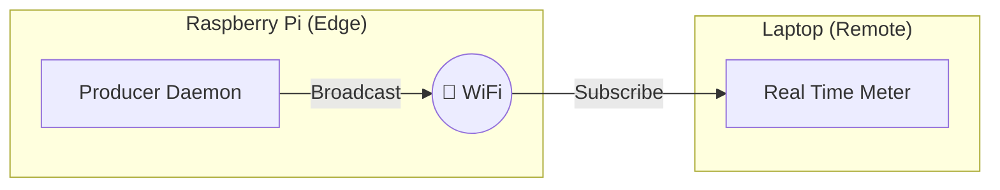

# Audio Measurement Framework 🎤 🐍

**A modular Python framework for building audio measurement applications with USB measurement microphones.**

> **Hardware Support:** This framework includes built-in device profiles for common measurement microphones:
>
> | Microphone | Sample Rates | Status |
> |------------|--------------|--------|
> | **UMIK-1** | 48kHz | Verified |
> | **UMIK-2** | 48/96/192kHz | Supported |
> | **Dayton UMM-6** | 48kHz | Supported |
> | **Earthworks M23/M30** | 44.1-192kHz | Supported (analog) |
>
> The framework auto-detects known devices and validates sample rate support. Configure custom devices via `settings.py` or environment variables.

Whether you are an audio engineer, a hobbyist, or a developer looking to integrate high-quality audio measurement into your Python projects, this framework is for you. It provides a solid foundation and a suite of ready-to-run tools to record, measure, and calibrate your microphone.

## 🌟 Two Ways to Use

### 1. As a Toolkit (For Users) 🛠️

Out of the box, it includes a suite of polished CLI applications to record, measure, and analyze audio without writing any code.

* **📋 List Audio Devices:** Scans your computer and lists all connected audio input devices.
* **📏 Calibrate:** Generate scientific FIR filters from your microphone's calibration file.
* **🎙️ Recorder:** A robust audio recorder that handles file names, directory creation, and buffering to save high-quality WAV files.
* **📈 Forensic Analysis:** Generate professional charts correlating digital levels with physical pressure.
* **📊 Real Time Meter:** A real-time digital meter that displays RMS, dBFS, LUFS (Loudness), and dBSP (Sound Pressure Level).

```text
INFO AudioConsumerThread [measured_at: 2025-12-14 10:59:17.672282] {'interval_s': '3.0000', 'rms': '0.0180', 'flux': '45.8031', 'dBFS': '-34.9183', 'LUFS': '-30.4443', 'dBSPL': '77.6267'} [audio-metrics]
```

### 2. As a Framework (For Developers) 👩‍💻

Stop fighting with `pyaudio` threads and buffer overflows. This project exposes its core `AudioBaseApp` class, allowing you to build custom audio apps in minutes.

* **🛡️ Process Isolation:** Your custom logic runs in a separate process from the audio capture, preventing glitches.
* **🌐 Distributed by Default:** Your app automatically supports remote streaming via ZeroMQ.
* **🧩 Plug-and-Play Sinks:** Just implement `handle(ctx)` to receive a `PipelineContext` with audio, timestamp, sample rate, and calibration metadata. The framework handles threading, hardware reconnection, and precise timing.


## 🚀 Getting Started

### Prerequisites

* **Python 3.9+**
* **PiP**

#### 📦 System Requirements (Audio Libraries)

You may need low-level audio drivers (`PortAudio`/`LibSndFile`) and ZeroMQ headers depending on your OS.

**🐧 Linux (Debian/Ubuntu):**

```bash
sudo apt update && sudo apt install libportaudio2 libsndfile1 ffmpeg libzmq3-dev -y
```

> 🍓 Raspberry Pi 4 Model B: ✅ Verified.
>
> This toolkit is fully compatible with the Raspberry Pi 4 B. It serves as an excellent platform for building standalone, headless acoustic monitoring stations or portable measurement rigs.

**🍎 macOS:**

```bash
brew install portaudio libsndfile zeromq
```

**🪟 Windows**

Generally, Python wheels include the necessary binaries. If you have issues, ensure you have the latest Visual C++ Redistributable installed. For the UMIK series, no special driver is needed (standard USB Audio Class), but ASIO4ALL is an optional recommendation for low-latency exclusive access.

### Installation

```bash
pip install umik-base-app
```

## 🏗️ Under the Hood: Process Isolation

This project uses a **Producer-Consumer** architecture to guarantee audio stability. It supports two distinct operational modes depending on your requirements:

### 1. Monolithic Mode (Default)
By default (no flags), the application runs as a **Single Process** using threads. This is the simplest way to run the app for desktop usage or quick testing. The Producer and Consumer share memory and communicate via a highly efficient, thread-safe queue.

### 2. The Daemon Philosophy (Priority & Reliability) 🛡️
For mission-critical monitoring, you can break the monolith. Unlike standard Python scripts that use *threads* (which share the same CPU core and are limited by the GIL), this mode allows you to run the **Producer** and **Consumer** as completely separate **System Processes**.

* **The Producer (Ear):** Captures audio and broadcasts it via ZeroMQ. It has no GUI, no heavy math, and uses minimal RAM. We run this with **Real-Time Priority** (`nice -n -20`) so the OS *always* lets it run, even if the system is under load.
* **The Consumer (Brain):** Subscribes to the stream to calculate FFTs, render plots, or run AI models. If this process hangs or crashes, the audio stream remains unbroken.


```mermaid
graph TD
    subgraph "High Priority Process (Nice -20)"
        Mic((🎤 UMIK)) -->|Capture| Producer[Producer Daemon]
        Producer -->|ZMQ PUB| Socket[Localhost:5555]
    end

    subgraph "Standard User Process"
        Socket -.->|ZMQ SUB| Consumer[Consumer App]
        Consumer -->|Heavy Math| Analysis[FFT / AI / Plot]
    end
```

### 3. Distributed Mode (Remote Monitoring) 🌐

Because the components communicate over TCP/IP, you aren't limited to one machine. You can capture audio on a Raspberry Pi and monitor it on your workstation.


```mermaid
graph LR
    subgraph "Raspberry Pi (Edge)"
        Producer[Producer Daemon] -->|Broadcast| Wifi((📶 WiFi))
    end
    
    subgraph "Laptop (Remote)"
        Wifi -->|Subscribe| Consumer[Real Time Meter]
    end
```

*Want to dive deeper? Check out the [Architecture Documentation](./docs/ARCHITECTURE.md).*

## 💻 How to Run

Whether you are testing on your laptop or deploying to a headless Raspberry Pi, there is a mode for you.

### 1. The "Quick Start" (Monolithic Mode)
*Best for: Testing, Development, and simple Desktop usage.*

Run everything in a single process. It is the easiest way to verify your hardware works.

```bash
# List available devices to find your ID
umik-list-devices

# Run the meter (Default Mic)
umik-real-time-meter

# Run with UMIK-1 Calibration
umik-real-time-meter --calibration-file "umik-1/700.txt"
```

### 2. The "Unstoppable Ear" (Daemon Mode) 🛡️

*Best for: Critical Monitoring on a single machine.*

To prevent audio glitches caused by heavy processing or GUI lag, run the capture process as a high-priority system daemon.

**Step 1: Start the Daemon (Producer)**
Use `nice -n -20` to give the audio capture maximum CPU priority. It will broadcast data locally on port 5555.

```bash
# Requires sudo to set negative nice values
sudo nice -n -20 umik-real-time-meter --producer --calibration-file "umik-1/700.txt" --zmq-port 5555
```

**Step 2: Start the App (Consumer)**
Connect your GUI or Recorder to the running daemon. You can open, close, or crash this app without ever breaking the audio stream.

```bash
umik-real-time-meter --consumer --zmq-host localhost --zmq-port 5555
```

### 3. The "Remote Sentry" (Distributed Mode) 🌐

*Best for: IoT, Headless Pis, and Remote Monitoring.*

Capture audio in one room (e.g., a server closet) and visualize it in another.

**On the Raspberry Pi (Edge Node):**

```bash
# Start the stream
umik-real-time-meter --producer --calibration-file "umik-1/700.txt" --zmq-port 5555
```

**On your Laptop (Workstation):**

```bash
# Connect over WiFi
umik-real-time-meter --consumer --zmq-host 192.168.1.50 --zmq-port 5555
```

### 4. Universal Recording 🎙️

The `umik-recorder` tool works in all modes. You can record directly from hardware or "tap in" to an existing stream to save it to disk.

```bash
# Option A: Direct Recording (Monolithic)
umik-recorder --calibration-file "umik-1/700.txt" --output-dir "local_recordings"

# Option B: Record a Daemon/Remote Stream (Consumer)
umik-recorder --consumer --zmq-host 192.168.1.50 --zmq-port 5555 --output-dir "remote_recordings"
```

## 📂 Understanding Calibration Files

The microphone in the UMIK Series are measurement microphones, meaning they rely on a software file to correct their frequency response.

When you download your unique files from MiniDSP (e.g., `7175488`), you will get `.txt` files. This app uses them to generate a digital FIR filter.

```
./umik-1/
├── 7175488.txt                     <-- 0° (On-Axis). Point at speakers.
├── 7175488_90deg.txt               <-- 90° (Ambient). Point at ceiling.
├── 7175488_fir_1024taps_48000hz.npy <-- [GENERATED] The calculated Filter Cache.
└── ...
```

## 📊 Analysis & Visualization

Beyond real-time monitoring, this toolkit provides powerful scripts to analyze recordings "offline".

1. **Single File Analysis**
Calculates RMS, Flux, dBFS, LUFS, and dBSPL (if calibrated) for a specific WAV file and saves it to CSV.

```bash
umik-metrics-analyzer "file.wav" --calibration-file "umik-1/700.txt"
```

2. **Visualization (Plotting)**
Turns your CSV data into professional-grade charts.
* **View (Popup Window):**
```bash
umik-metrics-plotter "file.csv"
```

* **Save (To Image):**
```bash
# Saves to file.png by default
umik-metrics-plotter "file.csv" --save
```

### 📉 Example Output

Below is an actual analysis generated by the toolkit. It shows the correlation between digital levels (dBFS/LUFS) and real-world pressure (dBSPL), along with the "Flux" index used to detect sudden noises.

* **View Raw Data:** [sample_recording_metrics.csv](./sample_recording_metrics.csv)
* **View High-Res Chart:** [sample_recording_metrics.png](./sample_recording_metrics.png)


## 👩‍💻 For Developers: Build Your Own App

This isn't just a set of tools; it's a framework. You can use it to build your own custom audio applications - like a baby monitor, a clap detector, or a secure stream recorder - without writing a single line of threading or hardware code.

The framework handles the heavy lifting (Producer-Consumer isolation, ZMQ transport, hardware watchdog) so you can focus on the logic.

### Core Concepts

#### PipelineContext
Every audio chunk flows through the pipeline wrapped in a `PipelineContext` object:

```python
@dataclass
class PipelineContext:
    audio: np.ndarray      # The audio samples
    timestamp: datetime    # When captured
    sample_rate: float     # Sample rate in Hz
    metadata: dict         # Transformer annotations (calibration state, etc.)
```

Transformers modify the audio and annotate the context. Sinks read the final result.

#### Calibration Architecture

The framework separates calibration into two independent transformers:

| Transformer | Purpose | CPU Cost | Use Case |
|-------------|---------|----------|----------|
| `GainTransformer` | Sensitivity correction (level) | O(n) - cheap | Real-time meters, quick dBSPL |
| `FirCorrectionTransformer` | Frequency response correction | O(n×taps) - expensive | Precision analysis, recording |

Use **gain-only** for real-time applications where CPU matters. Use **full calibration** (gain + FIR) when accuracy across the frequency spectrum is critical.

### Minimal Example: A "Loudness Printer"

**1. Define your Logic (The Sink)**

Implement `handle(ctx)` to receive the `PipelineContext`. Access audio, timestamp, and calibration metadata from the context.

```python
import numpy as np
from umik_base_app import AudioSink, PipelineContext

class LoudnessPrinterSink(AudioSink):
    def handle(self, ctx: PipelineContext) -> None:
        # Calculate simple RMS from context audio
        rms = np.sqrt(np.mean(ctx.audio**2))

        if rms > 0.05:
            # Check calibration state from context metadata
            cal_status = "calibrated" if ctx.is_gain_calibrated() else "raw"
            print(f"[{ctx.timestamp}] 📢 LOUD ({cal_status}): {rms:.4f}")
```

**2. Assemble the App**

Create an `AudioPipeline` with the sample rate and attach your sink.

```python
from umik_base_app import (
    AppArgs,
    AudioBaseApp,
    AudioPipeline,
)

def main():
    # 1. Get Configuration (CLI args + Defaults)
    args = AppArgs.get_args()
    config = AppArgs.validate_args(args)

    # 2. Build the Pipeline (sample_rate is required)
    pipeline = AudioPipeline(sample_rate=config.sample_rate)
    pipeline.add_sink(LoudnessPrinterSink())

    # 3. Run the App
    app = AudioBaseApp(app_config=config, pipeline=pipeline)
    app.run()

if __name__ == "__main__":
    main()
```

### Adding Calibration

You can add calibration transformers for scientifically accurate measurements:

**Option A: Full Calibration (Gain + FIR)**
```python
from umik_base_app.transformers.calibrator_adapter import CalibratorAdapter

# When config.calibration exists (user passed --calibration-file)
if config.calibration:
    pipeline.add_transformer(
        CalibratorAdapter(
            config.calibration.transformer,
            config.calibration.sensitivity_dbfs,
            config.calibration.reference_dbspl,
        )
    )
```

**Option B: Gain-Only Calibration (Lightweight)**
```python
from umik_base_app.transformers.gain_transformer import GainTransformer

# For real-time apps where CPU matters
if config.calibration:
    pipeline.add_transformer(
        GainTransformer(gain_linear=config.calibration.transformer.gain_transformer.gain)
    )
```

### Reading Calibration State in Sinks

Your sink can check what calibration was applied and calculate dBSPL accordingly:

```python
class MetricsSink(AudioSink):
    def handle(self, ctx: PipelineContext) -> None:
        dbfs = 20 * np.log10(np.sqrt(np.mean(ctx.audio**2)) + 1e-10)

        # Check calibration state
        if ctx.is_fully_calibrated():
            # Both gain and FIR applied - most accurate
            dbspl = dbfs + ctx.reference_dbspl
            accuracy = "full"
        elif ctx.is_gain_calibrated():
            # Gain only - accurate for broadband
            dbspl = dbfs + ctx.reference_dbspl
            accuracy = "gain-only"
        elif ctx.can_calculate_dbspl():
            # Raw audio but we have sensitivity metadata
            dbspl = dbfs - ctx.sensitivity_dbfs + ctx.reference_dbspl
            accuracy = "raw"
        else:
            dbspl = None
            accuracy = "uncalibrated"

        print(f"dBFS: {dbfs:.1f}, dBSPL: {dbspl}, accuracy: {accuracy}")
```

### Available Context Properties

| Property | Type | Description |
|----------|------|-------------|
| `ctx.audio` | `np.ndarray` | Audio samples |
| `ctx.timestamp` | `datetime` | Capture time |
| `ctx.sample_rate` | `float` | Sample rate (Hz) |
| `ctx.gain_applied` | `bool` | Was gain transformer applied? |
| `ctx.fir_applied` | `bool` | Was FIR transformer applied? |
| `ctx.sensitivity_dbfs` | `float?` | Mic sensitivity (if calibrated) |
| `ctx.reference_dbspl` | `float?` | Reference SPL (if calibrated) |
| `ctx.is_gain_calibrated()` | `bool` | Gain + sensitivity available? |
| `ctx.is_frequency_calibrated()` | `bool` | FIR applied? |
| `ctx.is_fully_calibrated()` | `bool` | Both gain and FIR? |
| `ctx.can_calculate_dbspl()` | `bool` | Have sensitivity + reference? |

### Why use the Framework?

By using the `AudioBaseApp` class, your custom script automatically inherits all the advanced features:

* **ZeroMQ Support:** Your app instantly works over the network with `--consumer`.
* **Process Isolation:** Run as a GUI app without blocking audio capture.
* **Calibration Metadata:** Access sensitivity, reference SPL, and calibration state via `PipelineContext`.
* **Device Profiles:** Auto-detection and sample rate validation for known microphones.


## 🎛️ Device Profiles & Multi-Rate Support

The framework includes a device profiles system that knows the capabilities of common measurement microphones:

```python
from umik_base_app.hardwares.device_capabilities import discover_capabilities

# Discover what your connected device supports
caps = discover_capabilities(device_id=5)

print(caps.device_name)           # "UMIK-2"
print(caps.supported_sample_rates) # (48000, 96000, 192000)
print(caps.profile.name)          # "UMIK-2" (matched from registry)
```

### Supported Microphones

| Microphone | Manufacturer | Sample Rates | Sensitivity |
|------------|--------------|--------------|-------------|
| UMIK-1 | miniDSP | 48kHz | -18 dBFS |
| UMIK-2 | miniDSP | 48/96/192kHz | -18 dBFS |
| UMM-6 | Dayton Audio | 48kHz | -18 dBFS |
| XREF 20 | Sonarworks | 48kHz | -26 dBFS |
| MM 1 | Beyerdynamic | 44.1-192kHz | -40 dBFS |
| M23/M30 | Earthworks | 44.1-192kHz | -36 dBFS |

### Adding Custom Profiles

For unsupported microphones, add a profile to `device_profiles.py`:

```python
MY_MIC = MicrophoneProfile(
    name="My Custom Mic",
    manufacturer="Custom",
    model_id="custom_mic",
    sample_rates=(48000, 96000),
    nominal_sensitivity_dbfs=-20.0,
    reference_dbspl=94.0,
    usb_name_patterns=("My Custom Mic", "CustomMic"),
)
```

## 📚 Documentation & Resources

* [Architecture Overview](./docs/ARCHITECTURE.md): Deep dive into the threading, pipeline pattern, and code structure.
* [Understanding Audio Metrics](./docs/METRICS.md): Learn the math behind RMS, LUFS, and dBSPL.
* [The UMIK Series Guide](./docs/UMIK-Series.md): Specific details about handling the UMIK Series hardware.

## 🔗 Related Projects

If you are interested in taking this further, check out my **Edge AI Acoustic Monitor** project. It uses similar principles but adds **Machine Learning** to classify sounds (like detecting chainsaws or birds) on embedded devices! 👉 [py-edge-ai-acoustic-monitoring-app](https://github.com/danielfcollier/py-edge-ai-acoustic-monitoring-app)

## 🤝 Contributing

Found a bug? Want to add support for another measurement microphone? Open an issue or pull request on [GitHub](https://github.com/danielfcollier/py-umik-base-app).

**Happy listening! 🎧**
