# Welcome to the UMIK-1 Python Toolkit! 🎤 🐍

**A friendly, modular framework for building audio applications with the MiniDSP UMIK-1.**

Welcome! Whether you are an audio engineer, a hobbyist, or a developer looking to integrate high-quality audio measurement into your Python projects, this toolkit is for you. It provides a solid foundation (the "Base App") and a suite of ready-to-run tools to record, measure, and calibrate your microphone.

## 🌟 What's Inside?

It's included several ready-made applications to get you started immediately:

* **📋 List Audio Devices:** Scans your computer and lists all connected audio input devices to help you find the specific "Device ID".
* **🔍 Get UMIK-1 ID:** A helper utility that specifically hunts for a device named "UMIK-1" and prints its ID automatically.
* **📏 Calibrate:** Reads the UMIK-1 unique calibration file and creates a digital filter to ensure your measurements are scientifically accurate.
* **🎙️ Recorder:** A robust audio recorder that handles file names, directory creation, and buffering to save high-quality WAV files.
* **📊 Decibel Meter:** A real-time digital meter that displays RMS, dBFS, LUFS (Loudness), and dBSPL (Sound Pressure Level).
    ```text
    INFO AudioConsumerThread [measured_at: 2025-12-14 10:59:17.672282] {'interval_s': '3.0000', 'rms': '0.0180', 'flux': '45.8031', 'dBFS': '-34.9183', 'LUFS': '-30.4443', 'dBSPL': '77.6267'} [audio-metrics]
    ```

## 🚀 Getting Started

### Prerequisites
* **Python 3.12+**
* **uv** (A fast Python tool manager. Install it via `curl -LsSf https://astral.sh/uv/install.sh | sh` or see their [docs](https://github.com/astral-sh/uv)).
* **Make** (Standard on Linux/Mac).

### 📦 System Requirements (Audio Libraries)

Depending on your OS, you may need to install low-level audio drivers for `pyaudio`/`sounddevice` and `soundfile` to work.

**🐧 Linux (Ubuntu/Debian)**

You must install `PortAudio` and `LibSndFile` headers:
```bash
sudo apt update && sudo apt install libportaudio2 libsndfile1 -y
```

**🍎 macOS**

If you encounter issues, install these libraries via Homebrew:
```bash
brew install portaudio libsndfile
```

**🪟 Windows** 

Generally, Python wheels include the necessary binaries. If you have issues, ensure you have the latest Visual C++ Redistributable installed. For the UMIK-1, no special driver is needed (it uses standard USB Audio Class), but ASIO4ALL is an optional recommendation if you need low-latency exclusive access.

### Installation

Use `make` to automate the setup. This command creates a virtual environment and installs all necessary libraries.

```bash
make install
```

### 🍓 Hardware Compatibility

This project is lightweight and efficient, making it perfect for embedded devices.

* **Raspberry Pi 4 Model B:** ✅ Verified.
    This toolkit is fully compatible with the Raspberry Pi 4 B. It serves as an excellent platform for building standalone, headless acoustic monitoring stations or portable measurement rigs.

## 🏗️ Under the Hood: The Base App

Curious how it works? This project isn't just a script; it's a multi-threaded framework designed for stability.

**The "Producer-Consumer" Model**: Instead of doing everything in one loop (which can cause audio glitches), the work has been split:

1. **The Ear (Producer)**: One thread does nothing but listen to the hardware and put audio into a queue.

2. **The Brain (Consumer)**: Another thread takes audio from the queue and processes it (calculates metrics, saves to disk, etc.).

```mermaid
graph LR
    Mic((🎤 UMIK-1)) -->|Raw Audio| Producer[Listener Thread]
    Producer -->|Buffer| Queue[Queue]
    Queue -->|Audio| Consumer[Consumer Thread]
    
    Consumer -->|Execute| Calibrator[Calibrator]
    Calibrator -->|Clean Audio| Meter[Decibel Meter]
    Calibrator -->|Clean Audio| Recorder[Recorder]
```



_Want to dive deeper? Check out the [Architecture Documentation](docs/ARCHITECTURE.md)._

## 📂 Understanding Calibration Files

The UMIK-1 is a measurement microphone, meaning it relies on a software file to correct its frequency response.

When you download your unique files from MiniDSP (using your serial number, e.g., `7175488`), you will get `.txt` files. When you run this app, it calculates a digital filter and saves a "Cache" file (`.npy`) so it starts up instantly next time.

Here is what the file structure looks like:
```
./umik-1/
├── 7175488.txt                     <-- Standard Calibration (0° / On-Axis). Use this for pointing at speakers.
├── 7175488_90deg.txt               <-- 90° Calibration. Use this for ambient room measurement (mic pointing at ceiling).
├── 7175488_fir_1024taps_48000hz.npy <-- [GENERATED] The calculated Filter Cache.
├── 7175488_fir_128taps_48000hz.npy  <-- [GENERATED] Cache for a smaller filter size.
└── ...
```

- `.txt` Files: These are the Source of Truth. Never delete them.
- `.npy` Files: These are generated by the app for speed. You can safely delete them; the app will just regenerate them from the `.txt` file on the next run.


## 💻 How to Run

### 🐧 Linux & 🍎 macOS

There are easy-to-use commands in the Makefile.

1. **List Devices:**

```bash
make list-audio-devices
```

_Or specifically find the UMIK-1 ID:_ `make get-umik-id`

2. **Calibrate:**

```bash
make calibrate-umik F="path/to/calibration_file.txt"
```

3. **Run Decibel Meter:**

```bash
# Default Mic
make decibel-meter-default-mic

# UMIK-1 (Requires calibration file)
make decibel-meter-umik-1 F="path/to/calibration_file.txt"
```

4. **Record Audio:**

```bash
make record-umik-1 F="path/to/calibration_file.txt" OUT="my_recording.wav"
```

### 🪟 Windows (Hints)

The Makefile is designed for Unix-like systems. For Windows, you have two options:

**Option A: Use WSL (Recommended)** Install the **Windows Subsystem for Linux (WSL)**. This allows you to run the `make` commands exactly as shown above in a Linux environment on your Windows machine.

**Option B: Manual Python Commands** If you prefer running native Windows Python, you can run the scripts directly using the `-m` (module) flag. _First, ensure your virtual environment is activated._

1. **List Devices:**

```powershell
python -m src.app.list_audio_devices
```

_Note the ID of your UMIK-1 from this list._

2. **Calibrate:**

```powershell
# Defaults to 1024 taps. Example using 512:
python -m src.app.calibrate "C:\path\to\calib.txt" --num-taps 512
```

3. **Run Decibel Meter:**

```powershell
# Replace <ID> with the number found in step 1
python -m src.app.decibel_meter --device-id <ID> --calibration-file "C:\path\to\calib.txt"
```

4. **Run Audio Recorder:**

```powershell
python -m src.app.record --device-id <ID> --calibration-file "C:\path\to\calib.txt" --output-file "recordings\test.wav"
```

## 📚 Documentation & Resources

There are detailed guides to help you understand the science and tech:
- [Architecture Overview](docs/ARCHITECTURE.md): Deep dive into the threading, pipeline pattern, and code structure.
- [Understanding Audio Metrics](docs/METRICS.md): Learn the math behind RMS, LUFS, and dBSPL. Great for students!
- [The UMIK-1 Guide](docs/UMIK-1.md): Specific details about handling the UMIK-1 hardware.

## 🔗 Related Projects

If you are interested in taking this further, check out my **Edge AI Acoustic Monitor** project (**under development**). It uses similar principles but adds **Machine Learning** to classify sounds (like detecting chainsaws or birds) on embedded devices! 👉 [py-edge-ai-acoustic-monitor-app](https://github.com/danielfcollier/py-edge-ai-acoustic-monitor-app)

## 🤝 Contributing

Found a bug? Want to add a feature? Check out the [CONTRIBUTING.md](CONTRIBUTING.md) to see how to run tests, lint your code, and submit Pull Requests.

Happy listening! 🎧