# Welcome to the UMIK-1 Python Toolkit! 🎤 🐍

**A friendly, modular framework for building audio applications with the MiniDSP UMIK-1.**

Welcome! Whether you are an audio engineer, a hobbyist, or a developer looking to integrate high-quality audio measurement into your Python projects, this toolkit is for you. It provides a solid foundation (the "Base App") and a suite of ready-to-run tools to record, measure, and calibrate your microphone.

## 🚀 Getting Started

### Prerequisites
* **Python 3.12+**
* **uv** (A fast Python tool manager. Install it via `curl -LsSf https://astral.sh/uv/install.sh | sh` or see their [docs](https://github.com/astral-sh/uv)).
* **Make** (Standard on Linux/Mac).

### Installation
Use `make` to automate the setup. This command creates a virtual environment and installs all necessary libraries.

```bash
make install
```

### 🍓 Hardware Compatibility

This project is lightweight and efficient, making it perfect for embedded devices.

* **Raspberry Pi 4 Model B:** ✅ Verified.
    This toolkit is fully compatible with the Raspberry Pi 4 B. It serves as an excellent platform for building standalone, headless acoustic monitoring stations or portable measurement rigs.

## 🌟 What's Inside?

It's included several ready-made applications to get you started immediately. Here is what they do in plain English:

### 1. 📋 List Audio Devices

**"Where is my microphone?"**

This simple tool scans your computer and lists all connected audio input devices. It helps you find the specific "Device ID" needed to tell Python which microphone to listen to.

* *Make target:* `make list-audio-devices`

### 2. 🔍 Get UMIK-1 ID

**"Find my UMIK-1 automatically."**

A helper utility that specifically hunts for a device named "UMIK-1" and prints its ID. It saves you from searching through the full list manually.
* *Make Target:* `make get-umik-id`

### 3. 📏 Calibrate

**"Make my microphone accurate."**

The UMIK-1 comes with a unique calibration file (a text file) that describes its specific sensitivity and frequency quirks. This tool reads that file and creates a digital filter (math magic!) to correct the audio signal, ensuring your measurements are scientifically accurate.

* *Make Target:* `make calibrate-umik F=path-to-my-calibration-file.txt`

### 4. 🎙️ Recorder

**"Capture high-quality audio."**

A robust audio recorder that saves sound from your UMIK-1 (or any mic) to WAV files. It handles the boring stuff like file names, directory creation, and preventing files from getting too big.

* *Make Target:* `make record F="path/to/calibration_file.txt`

### 5. 📊 Decibel Meter

**"How loud is it right now?"**
A real-time digital meter that displays various loudness metrics:
* **RMS & dBFS:** Digital signal levels.
* **LUFS:** Perceived loudness (how loud it *feels* to a human).
* **dBSPL:** Real-world sound pressure level (requires calibration).
* *Make Target:* `make decibel-meeter F="path/to/calibration_file.txt"`


## 🏗️ Under the Hood: The Base App

Curious how it works? This project isn't just a script; it's a multi-threaded framework designed for stability.

**The "Producer-Consumer" Model**: Instead of doing everything in one loop (which can cause audio glitches), the work has been split:

1. **The Ear (Producer)**: One thread does nothing but listen to the hardware and put audio into a queue.

2. **The Brain (Consumer)**: Another thread takes audio from the queue and processes it (calculates metrics, saves to disk, etc.).

```mermaid
graph LR
    Mic((🎤 UMIK-1)) -->|Raw Audio| Producer[Listener Thread]
    Producer -->|Buffer| Queue[Queue]
    Queue -->|Audio| Consumer[Consumer Thread]
    
    subgraph "The Pipeline"
        Consumer -->|Execute| Pipe{Pipeline}
        Pipe -->|Filter| Calibrator[Calibrator]
        Calibrator -->|Clean Audio| Meter[Decibel Meter]
        Calibrator -->|Clean Audio| Recorder[Recorder]
    end
```



_Want to dive deeper? Check out the [Architecture Documentation](docs/ARCHITECTURE.md)._

## 💻 How to Run

### 🐧 Linux & 🍎 macOS

There are easy-to-use commands in the Makefile.

1. List Devices:

```bash
make list-audio-devices
```

2. Run the Decibel Meter (Default Mic):

```bash
make decibel-meter-default-mic
```

3. Run with UMIK-1 (Calibrated): You need your calibration file (e.g., 700xxxx.txt).

```bash
make decibel-meter-umik-1 F="path/to/calibration_file.txt"
```

4. Record Audio:

```bash
make record-umik-1 F="path/to/calibration_file.txt" OUT="my_recording.wav"
```

### 🪟 Windows (Hints)

The Makefile is designed for Unix-like systems. For Windows, you have two options:

**Option A: Use WSL (Recommended)**

> Install the **Windows Subsystem for Linux (WSL)**. This allows you to run the commands exactly as shown above in a Linux environment on your Windows machine.

**Option B: Manual Python Commands**

> If you prefer running native Windows Python, you can run the scripts directly. First, ensure your virtual environment is activated.

1. List Devices:

```powershell
python src/app/list_audio_devices.py
```

_Note the ID of your UMIK-1._

2. Get Umik-1 Device ID:

```powershell
# Replace ID and PATH with your specific values
python src/app/decibel_meter.py --device-id <ID> --calibration-file "C:\path\to\calib.txt"
```

3. Calibrate Umik-1:

```powershell
# filter taps (defaults to 1024)
python -m src.app.calibrate "<path_to_calibration_file>" --num-taps 512
```

4. Run Decibel Meter:

```powershell
# Replace ID and PATH with your specific values
python src/app/decibel_meter.py --device-id <ID> --calibration-file "C:\path\to\calib.txt"
```

5. Run Audio Recorder:

```powershell
# Replace ID and PATH with your specific values
python src/app/record.py --device-id <ID> --calibration-file "C:\path\to\calib.txt" --output-file "recordings\umik_test.wav"
```

## 📚 Documentation & Resources

There are detailed guides to help you understand the science and tech:
- [Architecture Overview](docs/ARCHITECTURE.md): Deep dive into the threading, pipeline pattern, and code structure.
- [Understanding Audio Metrics](docs/METRICS.md): Learn the math behind RMS, LUFS, and dBSPL. Great for students!
- [The UMIK-1 Guide](docs/UMIK-1.md): Specific details about handling the UMIK-1 hardware.


## 🔗 Related Projects

If you are interested in taking this further, check out my **Edge AI Acoustic Monitor** project (**under development**). It uses similar principles but adds **Machine Learning** to classify sounds (like detecting chainsaws or birds) on embedded devices! 👉 [py-edge-ai-acoustic-monitor-app](https://github.com/danielfcollier/py-edge-ai-acoustic-monitor-app)

## 🤝 Contributing

Found a bug? Want to add a feature? Check out the [CONTRIBUTING.md](CONTRIBUTING.md) to see how to run tests, lint your code, and submit Pull Requests.

Happy listening! 🎧