# Welcome to the UMIK-1 Python Toolkit! 🎤 🐍

**A friendly, modular framework for building audio applications with the MiniDSP UMIK-1.**

Welcome! Whether you are an audio engineer, a hobbyist, or a developer looking to integrate high-quality audio measurement into your Python projects, this toolkit is for you. It provides a solid foundation (the "Base App") and a suite of ready-to-run tools to record, measure, and calibrate your microphone.

## 🌟 What's Inside?

It's included several ready-made applications to get you started immediately:

* **📋 List Audio Devices:** Scans your computer and lists all connected audio input devices to help you find the specific "Device ID".
* **🔍 Get UMIK-1 ID:** A helper utility that specifically hunts for a device named "UMIK-1" and prints its ID automatically.
* **📏 Calibrate:** Reads the UMIK-1 unique calibration file and creates a digital filter to ensure your measurements are scientifically accurate.
* **🎙️ Recorder:** A robust audio recorder that handles file names, directory creation, and buffering to save high-quality WAV files.
* **📊 Real Time Meter:** A real-time digital meter that displays RMS, dBFS, LUFS (Loudness), and dBSPL (Sound Pressure Level).
    ```text
    INFO AudioConsumerThread [measured_at: 2025-12-14 10:59:17.672282] {'interval_s': '3.0000', 'rms': '0.0180', 'flux': '45.8031', 'dBFS': '-34.9183', 'LUFS': '-30.4443', 'dBSPL': '77.6267'} [audio-metrics]
    ```

## 🚀 Getting Started

### Prerequisites
* **Python 3.12+**
* **PiP** 

#### 📦 System Requirements (Audio Libraries)

Depending on your OS, you may need to install low-level audio drivers for `pyaudio`/`sounddevice` and `soundfile` to work.

##### 🐧 Linux (Ubuntu/Debian)

You must install `PortAudio` and `LibSndFile` headers:
```bash
sudo apt update && sudo apt install libportaudio2 libsndfile1 ffmpeg -y
```

##### 🍎 macOS

If you encounter issues, install these libraries via Homebrew:
```bash
brew install portaudio libsndfile
```

##### 🪟 Windows 

Generally, Python wheels include the necessary binaries. If you have issues, ensure you have the latest Visual C++ Redistributable installed. For the UMIK-1, no special driver is needed (it uses standard USB Audio Class), but ASIO4ALL is an optional recommendation if you need low-latency exclusive access.

### Installation

```bash
pip install umik-base-app
```

### 🍓 Hardware Compatibility

This project is lightweight and efficient, making it perfect for embedded devices.

#### Raspberry Pi 4 Model B: ✅ Verified.
> This toolkit is fully compatible with the Raspberry Pi 4 B. It serves as an excellent platform for building standalone, headless acoustic monitoring stations or portable measurement rigs.

## 🏗️ Under the Hood: The Base App

Curious how it works? This project isn't just a script; it's a multi-threaded framework designed for stability.

**The "Producer-Consumer" Model**: Instead of doing everything in one loop (which can cause audio glitches), the work has been split:

1. **The Ear (Producer)**: One thread does nothing but listen to the hardware and put audio into a queue.

2. **The Brain (Consumer)**: Another thread takes audio from the queue and processes it (calculates metrics, saves to disk, etc.).

```mermaid
graph LR
    Mic((🎤 UMIK-1)) -->|Raw Audio| Producer[Listener Thread]
    Producer -->|Buffer| Queue[Queue]
    Queue -->|Audio| Consumer[Consumer Thread]
    
    Consumer -->|Execute| Calibrator[Calibrator]
    Calibrator -->|Clean Audio| Meter[Decibel Meter]
    Calibrator -->|Clean Audio| Recorder[Recorder]
```



_Want to dive deeper? Check out the [Architecture Documentation](https://github.com/danielfcollier/py-umik-base-app/docs/ARCHITECTURE.md)._

## 📂 Understanding Calibration Files

The UMIK-1 is a measurement microphone, meaning it relies on a software file to correct its frequency response.

When you download your unique files from MiniDSP (using your serial number, e.g., `7175488`), you will get `.txt` files. When you run this app, it calculates a digital filter and saves a "Cache" file (`.npy`) so it starts up instantly next time.

Here is what the file structure looks like:
```
./umik-1/
├── 7175488.txt                     <-- Standard Calibration (0° / On-Axis). Use this for pointing at speakers.
├── 7175488_90deg.txt               <-- 90° Calibration. Use this for ambient room measurement (mic pointing at ceiling).
├── 7175488_fir_1024taps_48000hz.npy <-- [GENERATED] The calculated Filter Cache.
├── 7175488_fir_128taps_48000hz.npy  <-- [GENERATED] Cache for a smaller filter size.
└── ...
```

- `.txt` Files: These are the Source of Truth. Never delete them.
- `.npy` Files: These are generated by the app for speed. You can safely delete them; the app will just regenerate them from the `.txt` file on the next run.

## 📊 Analysis & Visualization

Beyond real-time monitoring, this toolkit provides powerful scripts to analyze recordings "offline". This is perfect for tuning trigger thresholds or generating reports for noise complaints.

1. **Single File Analysis**
Calculates RMS, Flux, dBFS, LUFS, and dBSPL (if calibrated) for a specific WAV file and saves it to CSV.

```bash
umik-metrics-analyzer "file.wav" --calibration-file "umik-1/700.txt"
```

1. **Visualization (Plotting)**
Turns your CSV data into professional-grade charts.

- **View (Popup Window):**
```bash
umik-metrics-plot "file.csv"

- **Save (To Image):**
```bash
umik-metrics-plot "file.csv" --output=
```

### 📉 Example Output

Below is an actual analysis generated by the toolkit. It shows the correlation between digital levels (dBFS/LUFS) and real-world pressure (dBSPL), along with the "Flux" index used to detect sudden noises (like hammering or dogs barking).

- **View Raw Data:** [sample_recording_metrics.csv](https://github.com/danielfcollier/py-umik-base-app/sample_recording_metrics.csv)
- **View High-Res Chart:** [sample_recording_metrics.png](https://github.com/danielfcollier/py-umik-base-app/sample_recording_metrics.png)


## 💻 How to Run

There are easy-to-use commands.

1. **List Devices:**

```bash
umik-list-devices
```

_Or specifically find the UMIK-1 ID:_ `umik-list-devices --only`

2. **Calibrate:**

```bash
umik-calibrate "umik-1/700.txt"
```

3. **Run Real Time Meter:**

```bash
# Default Mic
umik-real-time-meter

# UMIK-1 (Requires calibration file)
umik-real-time-meter --calibration-file "umik-1/700.txt"
```

4. **Record Audio:**

```bash
# Default Mic
umik-recorder

# UMIK-1 (Requires calibration file)
umik-recorder --calibration-file "umik-1/700.txt" --output-dir "my_folder"
```

4. **Audio Analysis & Visualization:**

**Step 1:** Analyze a WAV file Generate a time-series CSV containing RMS, dBFS, LUFS, and dBSPL data.

```bash
# Analyze raw audio (Relative dBFS only)
umik-metrics-analyzer "recordings/my_audio.wav"

# Analyze with calibration (Absolute dBSPL & LUFS)
umik-metrics-analyzer "recordings/my_audio.wav" --calibration-file "umik-1/700.txt"
```

**Step 2:** Visualize the Results Create a professional dual-axis plot (Levels vs. Spectral Flux) from the generated CSV.

```bash
# Open interactive plot window
umik-metrics-plot "analysis.csv"

# Save plot to an image file (PNG)
umik-metrics-plot "analysis.csv" --save "chart.png"
```

## 📚 Documentation & Resources

There are detailed guides to help you understand the science and tech:
- [Architecture Overview](https://github.com/danielfcollier/py-umik-base-app/docs/ARCHITECTURE.md): Deep dive into the threading, pipeline pattern, and code structure.
- [Understanding Audio Metrics](https://github.com/danielfcollier/py-umik-base-app/docs/METRICS.md): Learn the math behind RMS, LUFS, and dBSPL. Great for students!
- [The UMIK-1 Guide](https://github.com/danielfcollier/py-umik-base-app/docs/UMIK-1.md): Specific details about handling the UMIK-1 hardware.

## 🔗 Related Projects

If you are interested in taking this further, check out my **Edge AI Acoustic Monitor** project (**under development**). It uses similar principles but adds **Machine Learning** to classify sounds (like detecting chainsaws or birds) on embedded devices! 👉 [py-edge-ai-acoustic-monitoring-app](https://github.com/danielfcollier/py-edge-ai-acoustic-monitoring-app)

## 🤝 Contributing

Found a bug? Want to add a feature? Check out the [CONTRIBUTING.md](https://github.com/danielfcollier/py-umik-base-app/CONTRIBUTING.md) to see how to run tests, lint your code, and submit Pull Requests.

**Happy listening! 🎧**