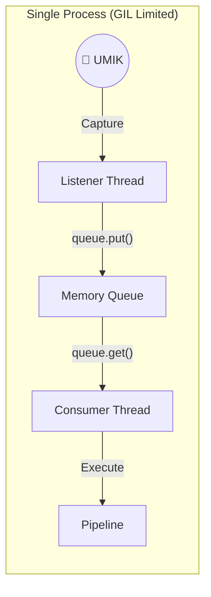
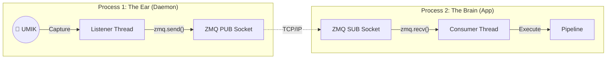
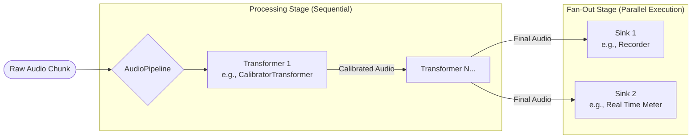
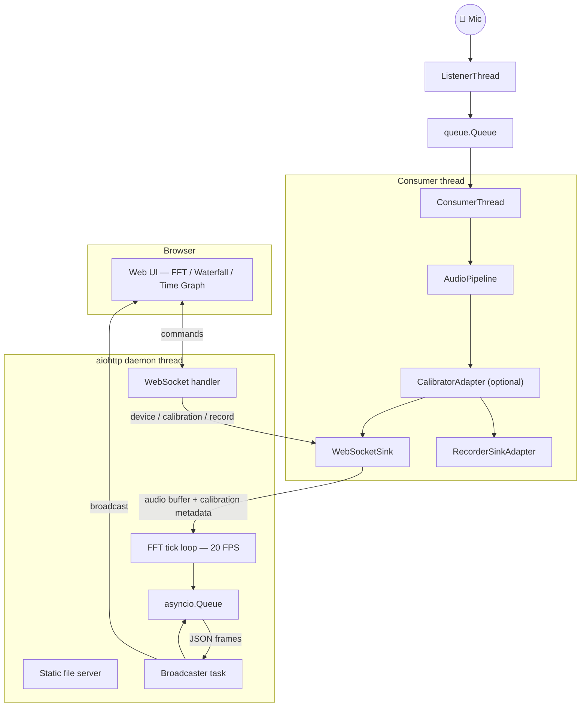

# Architecture Overview

This document describes the high-level software architecture of the Audio Measurement Framework. The application is designed for mission-critical audio monitoring using a **Producer-Consumer** pattern that can operate in two modes: **Monolithic** (Threaded) or **Distributed** (Process-Isolated).

## 1. Core Philosophy: The "Ear" vs. The "Brain"

To prevent audio glitches (buffer overflows), the application is decoupled into two distinct roles:

1.  **The Ear (Producer):**
    * **Responsibility:** Interacts with the hardware driver (`sounddevice`).
    * **Priority:** Critical. It must never block.
    * **Behavior:** Captures raw audio, timestamps it, and pushes it to the Transport Layer immediately.

2.  **The Brain (Consumer):**
    * **Responsibility:** Analysis, File I/O, Visualization.
    * **Priority:** Variable. It can lag behind without breaking the recording.
    * **Behavior:** Pulls data from the Transport Layer and executes the `AudioPipeline`.

## 2. Transport Layer (The Abstraction)

The "Ear" and "Brain" are connected by an abstract **Transport Layer**. This allows the application to switch its internal communication mechanism at runtime.

### Mode A: Monolithic (In-Memory Queue)
* **Flag:** Default (No flags).
* **Mechanism:** `queue.Queue` (Thread-Safe Memory).
* **Topology:** Single Python Process.
* **Pros:** Zero latency, simple to debug.
* **Cons:** Shared GIL (Global Interpreter Lock). Heavy processing in the Consumer can momentarily stall the Producer.


```mermaid
graph LR
    subgraph "Single Process (GIL Limited)"
        Mic((🎤 UMIK)) -->|Capture| L[Listener Thread]
        L -->|"queue.put()"| Q[Memory Queue]
        Q -->|"queue.get()"| C[Consumer Thread]
        C -->|Execute| P[Pipeline]
    end
```

### Mode B: Distributed (ZeroMQ / Process Isolation)

* **Flags:** `--producer` or `--consumer`.
* **Mechanism:** `ZeroMQ` (TCP Sockets via Pub-Sub).
* **Topology:** Multiple Isolated Processes (potentially across a network).
* **Pros:** * **Process Isolation:** The Producer can run as a high-priority system daemon (`nice -n -20`), completely immune to Consumer crashes or lag.
* **Remote Monitoring:** The Consumer can run on a different computer.


```mermaid
graph LR
    subgraph "Process 1: The Ear (Daemon)"
        Mic((🎤 UMIK)) -->|Capture| L[Listener Thread]
        L -->|"zmq.send()"| PUB[ZMQ PUB Socket]
    end

    PUB -.->|TCP/IP| SUB

    subgraph "Process 2: The Brain (App)"
        SUB[ZMQ SUB Socket] -->|"zmq.recv()"| C[Consumer Thread]
        C -->|Execute| P[Pipeline]
    end
```

## 3. The Audio Pipeline Pattern

Once the `ConsumerThread` retrieves data (from Queue or ZMQ), it passes it to the `AudioPipeline`. This pipeline implements a modular pattern consisting of **Transformers** and **Sinks**.

### Components

* `AudioTransformer` **(Transformers)**:
  * **Role**: Modifies the audio signal.
  * **Input**: Audio Chunk -> **Output**: Modified Audio Chunk.
  * **Example**: `CalibratorAdapter` applies an FIR filter to correct the frequency response.


* `AudioSink` **(Consumers)**:
  * **Role**: Consumes the final audio signal (side-effects only).
  * **Input**: Audio Chunk -> **Output**: None.
  * **Examples**:
  * `RecorderSinkAdapter`: Writes audio to a WAV file.
  * `AudioMetricsSink`: Calculates RMS/LUFS and logs them.


### Pipeline Diagram


```mermaid
graph LR
    Input([Raw Audio Chunk]) --> Pipeline{AudioPipeline}
    
    subgraph "Processing Stage (Sequential)"
        Pipeline --> Proc1[Transformer 1<br/>e.g., CalibratorTransformer]
        Proc1 -->|Calibrated Audio| Proc2[Transformer N...]
    end
    
    subgraph "Fan-Out Stage (Parallel Execution)"
        Proc2 -->|Final Audio| Sink1[Sink 1<br/>e.g., Recorder]
        Proc2 -->|Final Audio| Sink2[Sink 2<br/>e.g., Real Time Meter]
    end
```

## 4. Data Flow Overview

The lifecycle of a single audio chunk flows as follows:

1. **Hardware Capture**: `sounddevice` reads a block of samples (e.g., 1024 frames).

2. **Listener**: The `ListenerThread` receives this block and timestamps it.

3. **Transport**:
   - **Monolithic:** Pushes tuple `(chunk, timestamp)` to `queue.Queue`.
   - **Distributed:** Serializes tuple via `pickle` and broadcasts via `ZmqProducerTransport`.

4. **Consumption**: The ConsumerThread wakes up, retrieves/deserializes the block.

5. **Transformation**:
    - If a **Calibrator** is active, the pipeline applies an FIR filter (`scipy.signal.lfilter`).

6. **Sinking**:
   - **Recorder Sink**: Writes bytes to disk.
   - **Metrics Sink**: Calculates RMS, flux, or accumulates samples for LUFS measurement.

## 5. Spectrum Analyzer — WebSocket Pipeline

The `audio-tools-spectrum` app adds a browser-based visualization layer on top of the standard pipeline. Its architecture differs from the other apps in two key ways:

1. **A persistent aiohttp server** runs in a dedicated daemon thread, hosting both the WebSocket endpoint (`/ws`) and the static web frontend (`/`).
2. **A separate FFT tick loop** (20 FPS, asyncio) processes audio frames independently from the audio callback thread, decoupling display rate from capture rate.

### Pipeline Structure

The spectrum analyzer uses a two-sink pipeline. Both sinks receive the same audio — raw when no calibration is active, FIR-corrected and gain-adjusted when a calibration file is loaded.

```
CalibratorAdapter (optional, loaded via browser UI)
        │
        ├──► WebSocketSink      — FFT display, dBSPL, SNR, noise floor
        └──► RecorderSinkAdapter — WAV recording (active only while REC is pressed)
```

`WebSocketSink` holds a shared audio buffer that the FFT tick loop reads from. Calibration metadata (`sensitivity_dbfs`, `reference_dbspl`, `is_gain_calibrated`) is read from `PipelineContext` on each audio chunk and used by the tick loop for dBSPL conversion.

### FFT Tick Loop

Audio arrives from `ConsumerThread` at PortAudio callback granularity (~85 ms blocks at 48 kHz). The tick loop runs at 20 FPS in the asyncio event loop:

1. **Frame extraction** (`_consume_next_frame`): reads the next hop-aligned 2048-sample frame from the latest audio block.
2. **Windowing**: applies a Hann window to reduce spectral leakage.
3. **FFT**: `np.fft.rfft` → magnitude in dB.
4. **Log binning**: 256 bins spaced geometrically between 20 Hz and Nyquist; each bin takes the mean of the FFT bins that fall within its range.
5. **dBSPL**: converts RMS of the raw frame using calibration metadata from `PipelineContext`.
6. **Broadcast**: serializes to JSON and pushes to the asyncio broadcast queue → all connected WebSocket clients.

### NoiseFloorTracker

A 5-second quiet room baseline is captured on demand ("Capture Quiet Room" button). Once established:

- Per-bin SNR is computed against the live spectrum on every FFT frame.
- Average SNR classifies microphone state: **OK** (≥ 20 dB), **LOW** (≥ 10 dB), **NOISE** (< 10 dB).
- The noise floor is overlaid on the FFT plot and exported with the CSV.

### Device Switching

Switching the input device from the browser toolbar triggers a chain of events across thread boundaries:

1. The browser sends `{ type: "change_device", device_id: N }` over WebSocket.
2. `WebSocketSink` calls `app.switch_device(N)` via a module-level `_app_instance` reference (avoids cross-thread import issues).
3. `SpectrumAnalyzerApp.switch_device()` updates `HardwareConfig`, sets `listener.restart_event` to trigger reconnect, clears pipeline processors, and calls `ws_sink.notify_calibration_cleared()`.
4. The browser receives a `calibration_cleared` message and resets the calibration UI and file input.

### Architecture Diagram


```mermaid
graph TD
    subgraph Browser
        UI[Web UI — FFT / Waterfall / Time Graph]
    end

    subgraph "aiohttp daemon thread"
        HTTP[Static file server]
        WS[WebSocket handler]
        BC[Broadcaster task]
        FFTL[FFT tick loop — 20 FPS]
        AQ[asyncio.Queue]
        FFTL --> AQ
        BC --> AQ
    end

    subgraph "Consumer thread"
        CT[ConsumerThread] --> PL[AudioPipeline]
        PL --> CAL["CalibratorAdapter (optional)"]
        CAL --> WSS[WebSocketSink]
        CAL --> REC[RecorderSinkAdapter]
    end

    Mic((🎤 Mic)) --> LT[ListenerThread] --> Q[queue.Queue] --> CT

    WSS -->|audio buffer + calibration metadata| FFTL
    AQ -->|JSON frames| BC
    BC -->|broadcast| UI
    UI <-->|commands| WS
    WS -->|device / calibration / record| WSS
```
