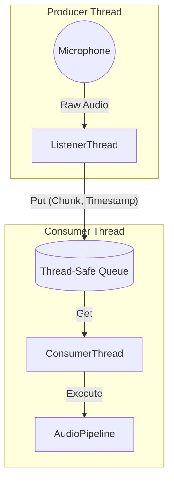
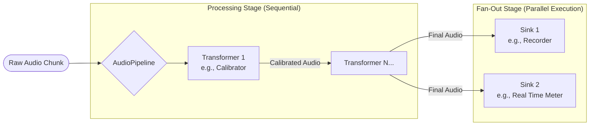

# Architecture Overview

This document describes the high-level software architecture of the `py-umik-base-app`. The application is designed for real-time audio processing using a **Producer-Consumer** concurrency model and a modular **Pipeline** pattern for audio handling.

## 1. Concurrency Model (Producer-Consumer)

The application handles real-time audio by decoupling the **capture** of audio data from its **processing**. This prevents heavy processing tasks (like FFTs or file I/O) from blocking the audio stream and causing buffer overflows (glitches).

This is achieved using two dedicated threads managed by the `BaseApp` class:

1.  **`ListenerThread` (The Producer):**
    * **Responsibility:** Interacts directly with the hardware via `sounddevice`. It captures raw audio chunks.
    * **Behavior:** It runs a "Watchdog" loop that handles hardware reconnections. If the microphone disconnects, it attempts to reconnect automatically.
    * **Output:** Puts tuples of `(audio_chunk, timestamp)` into a thread-safe `queue.Queue`.

2.  **`ConsumerThread` (The Consumer):**
    * **Responsibility:** Monitors the queue for new data.
    * **Behavior:** It pulls audio chunks from the queue and delegates them to the `AudioPipeline` for processing.
    * **Output:** Triggers the pipeline execution.

### Concurrency Diagram

## 2. The Audio Pipeline Pattern
Once the `ConsumerThread` retrieves data, it passes it to the `AudioPipeline`. The pipeline implements a modular pattern consisting of **Transformers** and **Sinks**.

### Components
- `AudioTransformer` **(Transformers)**:
  - **Role**: Modifies the audio signal.
  - **Input**: Audio Chunk -> **Output**: Modified Audio Chunk.
  - **Example**: `HardwareCalibratorAdapter` applies an FIR filter to correct the frequency response.

- `AudioSink` **(Consumers)**:
  - **Role**: Consumes the final audio signal (side-effects only).
  - **Input**: Audio Chunk -> **Output**: None.
  - **Examples**:
    - `IORecorderAdapter`: Writes audio to a WAV file.
    - `AudioMetricsSink`: Calculates RMS/LUFS and logs them.

### Pipeline Diagram

## 3. Data Flow Overview

The lifecycle of a single audio chunk flows as follows:

1. **Hardware Capture**: `sounddevice` reads a block of samples (e.g., 1024 frames) from the OS audio buffer.
2. **Listener**: The `ListenerThread` receives this block and timestamps it.
3. **Queueing**: The block is pushed to the internal `queue.Queue`.
4. **Consumption**: The ConsumerThread wakes up, retrieves the block, and calls pipeline.execute().
5. **Transformation**:
   - If a **Calibrator** is active, the pipeline passes the chunk through the `HardwareCalibrator`.
   - The calibrator applies an FIR filter (`scipy.signal.lfilter`) to flatten the frequency response.
6. **Sinking**:
   - The pipeline passes the processed chunk to all registered Sinks.
    - **Recorder Sink**: Writes bytes to disk (handling file rotation if needed).
    - **Metrics Sink**: Calculates RMS, flux, or accumulates samples for LUFS measurement.

## 4. Key Directories

The project structure separates reusable library code from specific application logic:
- `src/py_umik/` **(Core Framework)**:
  - Contains generic, reusable components.
  - `audio_device/`: Hardware selection, configuration, and calibration logic.
  - `audio_streams/`: Threading logic (`Listener`, `Consumer`), `Recorder`, and `Queue` management.
  - `audio_pipeline.py`, `audio_metrics.py`: Core processing logic.
  - **_Design Rule_**: Code here should not depend on specific CLI arguments or application states.

- `src/samples/` **(Application Layer)**:
  - Contains the concrete entry points (scripts) that stitch the library components together.
  - `apps/real_time_meter.py`: A specific app that combines the `HardwareCalibrator` (Transformer) and a `MetricsSink` (Sink).
  - `apps/basic_recorder.py`: A specific app that combines the `HardwareCalibrator` (Transformer) and a `Recorder` (Sink).
  - **_Design Rule_**: These files handle `argparse`, logging configuration, and initialization.

