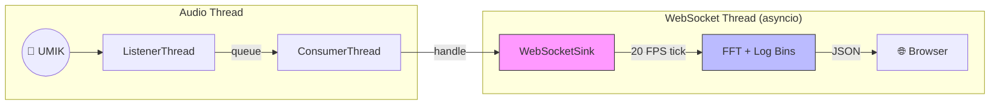

# 🌊 Building a Browser-Based Real-Time Spectrum Analyzer in Python

The terminal meter I built in earlier posts answers one question: *"How loud is it?"*

But loudness is only half the story. **Where** in the frequency spectrum is the energy? Is that 70 dB reading a flat broadband noise or a single sharp peak at 120 Hz? For room acoustics, speaker alignment, and noise floor characterization, you need to see the full picture — and a scrolling number in a terminal won't cut it.

The answer came as an open-source contribution: **Vladimir Hulagov** ([@vhulagov](https://github.com/vhulagov)) built a browser-based **Real-Time Analyzer (RTA)** for `umik-base-app`. This is comparable to the RTA panel in REW (Room EQ Wizard), running entirely in Python, with zero JavaScript build step.

> 🙏 **Contributor credit:** The spectrum analyzer — including the WebSocket server, FFT pipeline, log-binning, waterfall, and browser UI — was designed and implemented by **Vladimir Hulagov**. This post documents the architecture he created.

```bash
# Launch it — browser opens automatically at http://localhost:8767
audio-tools-spectrum --device <id> --calibration-file "umik-1/7175488.txt"
```

## 🧵 The Architecture Problem: Three Worlds, One Data Stream

Adding a browser UI to a real-time audio pipeline sounds straightforward until you think about the execution models involved:

1. **Audio capture** runs on a `sounddevice` callback thread — microsecond timing, no blocking allowed.
2. **FFT processing** runs in Python — CPU-bound numpy math.
3. **The browser** speaks HTTP and WebSocket — async I/O, event-driven.

These three worlds have completely different timing and threading requirements. The solution is to give each its own domain and connect them with the same producer-consumer pattern [described in post 01](./01%20-%20Architecture.md).



The `WebSocketSink` runs an `aiohttp` server in its own background thread with a private `asyncio` event loop. The audio consumer calls `handle()` synchronously — it just deposits the raw audio chunk into a thread-safe buffer. The async world picks it up at its own pace via a 20 FPS tick.

```python
# The handoff point — no blocking, no waiting
def handle_audio(self, audio_chunk: np.ndarray, timestamp: datetime) -> None:
    audio = audio_chunk.flatten()
    with self._audio_lock:
        self._latest_audio = audio
        self._audio_offset = 0
```

The critical invariant: **the audio thread never waits on the browser.** A slow client connection or a busy JavaScript renderer cannot cause a buffer overflow.

## 📊 The FFT Pipeline: From Samples to 256 Log Bins

Each 20 FPS tick pulls a 2048-sample frame (with 50% overlap) from the audio buffer and runs a standard short-time FFT:

```python
# 1. Apply Hann window to reduce spectral leakage
windowed = frame * self._hann_window   # np.hanning(2048)

# 2. FFT → complex spectrum → magnitude in dB
spec = np.fft.rfft(windowed)
magnitude_db = 20.0 * np.log10(np.abs(spec) + EPS)
```

A 2048-point FFT at 48 kHz gives 1025 linear frequency bins with ~23 Hz spacing. That's too many for a useful display — and linear spacing wastes resolution in the bass where the interesting octaves are.

The solution is **logarithmic binning**: compress the 1025 linear bins into 256 log-spaced bins, each representing a constant fraction of an octave. Bin centers are computed as the geometric mean of each bin's edges:

```python
log_edges = np.logspace(np.log10(20.0), np.log10(nyquist), 257)
bin_freqs = np.sqrt(log_edges[:-1] * log_edges[1:])  # geometric mean
```

The result is a display that gives equal visual weight to every octave — just like human hearing.

## 🔇 The Noise Floor Tracker

One standout feature of Vladimir's design is the **quiet room baseline**.

Hit "Capture Noise Floor" in the browser, keep the room silent for 5 seconds, and the `NoiseFloorTracker` accumulates FFT frames and averages them into a per-bin baseline:

```python
def feed(self, magnitude_db: np.ndarray):
    if self._capturing:
        self._capture_frames.append(magnitude_db.copy())
        if len(self._capture_frames) >= self._target_frames:
            self.noise_floor_db = np.mean(np.array(self._capture_frames), axis=0)
```

Once set, every subsequent frame is compared against this baseline to produce a per-bin **SNR**, with three status levels:

| SNR | Status | Meaning |
|-----|--------|---------|
| > 10 dB | `OK` | Signal is clearly above the noise floor |
| 3–10 dB | `LOW` | Signal is marginal — consider moving closer |
| < 3 dB | `NOISE` | Dominated by self-noise — quiet room too loud, or mic too far |

This turns the RTA from a "pretty spectrum" into a diagnostic instrument: you can immediately see which frequency bands have useful signal and which are buried in noise.

## 🌐 Why the Browser?

The previous TUI (Textual) works beautifully for a terminal dashboard. But a spectrum analyzer needs:

* **A canvas-based FFT plot** — character cells can't represent 256 bins smoothly.
* **A scrolling waterfall** — time-series of FFT frames, essential for spotting intermittent noise sources.
* **File upload** — drag-and-drop calibration file loading without CLI flags.
* **Live device switching** — change the input mic without restarting the server.

All of this is native in a browser. The Python side serves a static `index.html` + CSS + JS bundle via `aiohttp` and sends one JSON message per frame over WebSocket. The browser handles all rendering.

The WebSocket message is intentionally minimal:

```json
{
  "type": "fft",
  "data": [/* 256 dB values */],
  "freqs": [/* 256 Hz center frequencies */],
  "db_spl": 68.4,
  "calibrated": true,
  "snr_avg": 22.1,
  "snr_status": "OK",
  "noise_floor": [/* 256 dB values, or null */]
}
```

The browser does the rest — plot, waterfall, time-series graph, status bar — all at 20 FPS.

## 🎛️ Calibration in the Browser

Loading a calibration file no longer requires a CLI flag. The browser toolbar has a "Load Calibration" button. When the user selects a `.txt` file, it is read by the browser and sent over WebSocket as a `load_calibration` message. The server writes it to a temp file, builds the FIR filter, and hot-swaps the transformer into the live pipeline — no restart required.

Switching devices automatically clears the calibration, because a calibration file is per-unit: a file for serial `7175488` is physically wrong for a different microphone, even of the same model.

## 🔮 What's Next

The spectrum analyzer is currently a **measurement tool** — it shows you what's happening in the room right now. The natural evolution is to layer **pattern recognition** on top: use the noise floor baseline and waterfall data to detect specific acoustic signatures automatically. That is the territory I explored in [post 05](./05%20-%20Edge%20Acoustic%20Monitoring.md) — and the `AudioSink` interface is already the right hook for an `InferenceSink`.

👉 **Try it:** [github.com/danielfcollier/py-umik-base-app](https://github.com/danielfcollier/py-umik-base-app)

#Python #AudioEngineering #DSP #WebSockets #RealTimeSystems #FFT #RoomAcoustics #OpenSource #aiohttp
